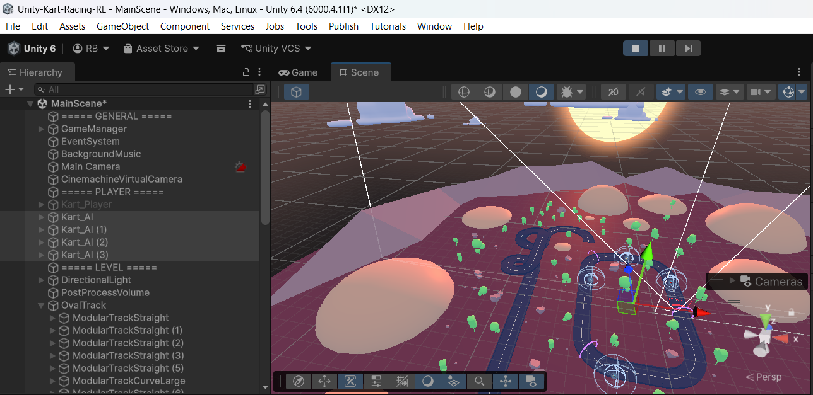

# Autonomous Car Racing using Reinforcement Learning

A Proximal Policy Optimization (PPO) agent that learns to drive and complete a lap in the **Gymnasium `CarRacing-v3`** environment from raw pixel observations.

## Demo

Watch the best-trained PPO agent complete a full lap successfully:

[](./videos/best_model.mp4)

### Unity ML-Agents Results

Unity training timing snapshot:



---

## Project Structure

```
car-racing/
├── Unity-Kart-Racing-RL/ # Unity 3D ML-Agents Project
├── train.py              # PPO training script with checkpoint callbacks
├── infer.py              # Evaluation & video recording script
├── models/               # Saved checkpoints (.zip) — created during training
├── logs/                 # TensorBoard logs — created during training
└── videos/               # Output MP4 videos — created during inference
```

---

## 🏎️ Unity 3D ML-Agents Setup

This repository also contains a full 3D Unity ML-Agents project where a Kart learns to drive using Reinforcement Learning.

### Prerequisites
- **Unity Hub** and **Unity Editor `6000.4.1f1`** (or a compatible version).
- **Git LFS** (Large File Storage) installed on your machine before cloning.

### How to Clone and Open
1. **Install Git LFS** (if you haven't already):
   ```bash
   git lfs install
   ```
2. **Clone the repository**:
   ```bash
   git clone https://github.com/abhijitdalal26/autonomous-racing-using-rl.git
   cd autonomous-racing-using-rl
   ```
3. **Open in Unity**:
   - Open **Unity Hub**.
   - Click **Add** -> **Add project from disk**.
   - Select the `Unity-Kart-Racing-RL` folder (not the root `car-racing` folder).
   - Click on the project to open it in Unity `6000.4.1f1`.

*(Note: Unity will take some time to download libraries and compile scripts during the first launch. This is expected as the `Library/` cache is purposely ignored in Git.)*

---

## 🏁 2D Gymnasium Setup

## Environment

| Property | Value |
|---|---|
| Environment | `CarRacing-v3` (Gymnasium) |
| Observation | Top-down RGB image 96×96 (converted to grayscale) |
| Action space | Continuous: [steering, gas, braking] |
| Termination | `terminated=True` when track completed (new in v3) |

---

## Setup

```bash
# Create conda environment
conda create -y -n car-rl python=3.10
conda activate car-rl

# Install PyTorch with CUDA 12.4
pip install torch torchvision --index-url https://download.pytorch.org/whl/cu124

# Install RL dependencies
pip install "gymnasium[box2d]" "stable-baselines3[extra]" tensorboard opencv-python
```

---

## Training

```bash
# Quick sanity-check (5 000 steps, ~1 min)
conda activate car-rl
python train.py --test

# Full training (1.5M steps on 4 parallel envs — several hours)
python train.py

# Custom parameters
python train.py --timesteps 2000000 --n-envs 4
```

### PPO Hyperparameters

| Parameter | Value | Rationale |
|---|---|----|
| Policy | `CnnPolicy` | Image observations |
| n_steps | 512 | Steps per env per rollout |
| batch_size | 128 | Mini-batch for gradient update |
| n_epochs | 10 | Passes over each rollout buffer |
| learning_rate | 3e-4 | Adam LR — reliable default |
| gamma | 0.99 | Reward discount |
| gae_lambda | 0.95 | GAE bias-variance trade-off |
| clip_range | 0.2 | PPO clipping epsilon |
| ent_coef | 0.01 | Entropy bonus for exploration |
| Frame stack | 4 | Gives agent velocity perception |

### Monitoring Training with TensorBoard

```bash
conda activate car-rl
tensorboard --logdir ./logs
# Open http://localhost:6006
```

**Track these metrics during training:**
- `rollout/ep_rew_mean` — mean episode reward (target: >900)
- `rollout/ep_len_mean` — episode length
- `train/loss` and `train/policy_gradient_loss`
- `train/value_loss`
- `train/entropy_loss` — should decrease gradually
- `train/explained_variance` — should increase toward 1.0

---

## Inference & Video Recording

```bash
# Evaluate a checkpoint and save a video
conda activate car-rl
python infer.py --model models/ppo_carracing_50000_steps.zip   # early
python infer.py --model models/ppo_carracing_300000_steps.zip  # mid
python infer.py --model models/best_model.zip                  # best
```

Videos are saved to `./videos/`.

---

## Checkpoint Strategy (for report)

| Checkpoint | Timesteps | Expected Behaviour |
|---|---|---|
| Model 1 (Early) | ~50 000 | Car goes off-road quickly |
| Model 2 (Mid) | ~300 000-400 000 | Follows track but doesn't complete |
| Model 3 (Final) | 1 000 000+ | Completes the full lap |

---

## Hardware

- GPU: NVIDIA GeForce RTX 3050 (6 GB VRAM)
- CUDA: 12.4
- PyTorch: 2.6.0+cu124
