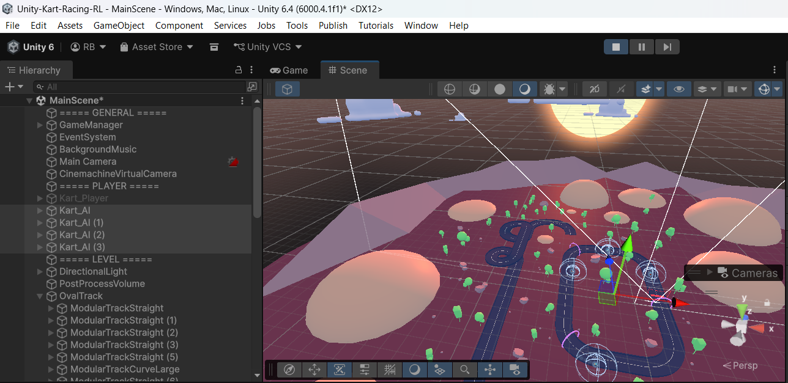

# Autonomous Car Racing using Reinforcement Learning

This project implements autonomous racing agents trained using Deep Reinforcement Learning. It was developed in two phases: I initially used the 2D **Gymnasium `CarRacing-v3`** environment to get familiar with reinforcement learning workflows (including CNN policies, image processing, and frame stacking), and subsequently scaled up the implementation into a 3D environment using **Unity ML-Agents** (PPO) to train a kart to drive autonomously on a track.

## Demo

Watch the best-trained PPO agent complete a full lap successfully:

[](./videos/best_model.mp4)

### Unity ML-Agents Results

Unity training timing snapshot:



---

## Project Structure

```
car-racing/
├── Unity-Kart-Racing-RL/ # Unity 3D ML-Agents Project
├── train.py              # PPO training script with checkpoint callbacks
├── infer.py              # Evaluation & video recording script
├── models/               # Saved checkpoints (.zip) — created during training
├── logs/                 # TensorBoard logs — created during training
└── videos/               # Output MP4 videos — created during inference
```

---

## 🏎️ Unity 3D ML-Agents Setup

This repository also contains a full 3D Unity ML-Agents project where a Kart learns to drive using Reinforcement Learning.

### Prerequisites
- **Unity Hub** and **Unity Editor `6000.4.1f1`** (or a compatible version).
- **Git LFS** (Large File Storage) installed on your machine before cloning.

### How to Clone and Open
1. **Install Git LFS** (if you haven't already):
   ```bash
   git lfs install
   ```
2. **Clone the repository**:
   ```bash
   git clone https://github.com/abhijitdalal26/autonomous-racing-using-rl.git
   cd autonomous-racing-using-rl
   ```
3. **Open in Unity**:
   - Open **Unity Hub**.
   - Click **Add** -> **Add project from disk**.
   - Select the `Unity-Kart-Racing-RL` folder (not the root `car-racing` folder).
   - Click on the project to open it in Unity `6000.4.1f1`.

*(Note: Unity will take some time to download libraries and compile scripts during the first launch. This is expected as the `Library/` cache is purposely ignored in Git.)*

### Custom Unity Scripts
To tailor the default Unity Karting Microgame for Reinforcement Learning training, I wrote/modified the following core C# scripts:
- **[KartAgent.cs](file:///d:/AI-ML/car-racing/Unity-Kart-Racing-RL/Assets/Karting/Scripts/AI/KartAgent.cs)**: Custom agent class implementing the ML-Agents API. Handles vector observations (5 raycast direction sensors + speed/velocity components), reward distribution (checkpoint success vs off-track/collision penalties), and physics resets. Also includes a `UseScenePositionOnStart` toggle for testing models from custom starting editor points.
- **[ArcadeKart.cs](file:///d:/AI-ML/car-racing/Unity-Kart-Racing-RL/Assets/Karting/Scripts/ArcadeKart.cs)**: Driving physics controller, modified to cleanly handle dynamic input refreshing and safely skip destroyed/null references during episode resets.
- **[GameFlowManager.cs](file:///d:/AI-ML/car-racing/Unity-Kart-Racing-RL/Assets/Karting/Scripts/GameFlowManager.cs)**: Controls game loops (countdown, winning, and losing scenes). Modified to detect active training configurations, skip the pre-race 3-2-1 countdown, and bypass loading scene transitions during training.

### Play the Standalone Build Directly
If you want to try the final trained model without installing Unity or setting up the Python environments, a standalone pre-built executable is provided:
1. Extract the compressed file [Build.rar](file:///d:/AI-ML/car-racing/Unity-Kart-Racing-RL/Build.rar).
2. Run the executable game file to watch the trained agent drive the kart autonomously on the track.

---

## 🏁 2D Gymnasium Setup

## Environment

| Property | Value |
|---|---|
| Environment | `CarRacing-v3` (Gymnasium) |
| Observation | Top-down RGB image 96×96 (converted to grayscale) |
| Action space | Continuous: [steering, gas, braking] |
| Termination | `terminated=True` when track completed (new in v3) |

---

## Setup

```bash
# Create conda environment
conda create -y -n car-rl python=3.10
conda activate car-rl

# Install PyTorch with CUDA 12.4
pip install torch torchvision --index-url https://download.pytorch.org/whl/cu124

# Install RL dependencies
pip install "gymnasium[box2d]" "stable-baselines3[extra]" tensorboard opencv-python
```

---

## Training

```bash
# Quick sanity-check (5 000 steps, ~1 min)
conda activate car-rl
python train.py --test

# Full training (1.5M steps on 4 parallel envs — several hours)
python train.py

# Custom parameters
python train.py --timesteps 2000000 --n-envs 4
```

### PPO Hyperparameters

| Parameter | Value | Rationale |
|---|---|----|
| Policy | `CnnPolicy` | Image observations |
| n_steps | 512 | Steps per env per rollout |
| batch_size | 128 | Mini-batch for gradient update |
| n_epochs | 10 | Passes over each rollout buffer |
| learning_rate | 3e-4 | Adam LR — reliable default |
| gamma | 0.99 | Reward discount |
| gae_lambda | 0.95 | GAE bias-variance trade-off |
| clip_range | 0.2 | PPO clipping epsilon |
| ent_coef | 0.01 | Entropy bonus for exploration |
| Frame stack | 4 | Gives agent velocity perception |

### Monitoring Training with TensorBoard

```bash
conda activate car-rl
tensorboard --logdir ./logs
# Open http://localhost:6006
```

**Track these metrics during training:**
- `rollout/ep_rew_mean` — mean episode reward (target: >900)
- `rollout/ep_len_mean` — episode length
- `train/loss` and `train/policy_gradient_loss`
- `train/value_loss`
- `train/entropy_loss` — should decrease gradually
- `train/explained_variance` — should increase toward 1.0

> [!TIP]
> **Training Plots:** You can view high-resolution plots of these training metrics (including reward curves and loss histories) directly in the [images/](file:///d:/AI-ML/car-racing/images/) directory.

---

## Checkpoint Strategy (for report)

| Checkpoint | Timesteps | Expected Behaviour |
|---|---|---|
| Model 1 (Early) | ~50 000 | Car goes off-road quickly |
| Model 2 (Mid) | ~300 000-400 000 | Follows track but doesn't complete |
| Model 3 (Final) | 1 000 000+ | Completes the full lap |

---

## References

1. Schulman, J., Wolski, F., Dhariwal, P., Radford, A., & Klimov, O. (2017). *Proximal Policy Optimization Algorithms*. OpenAI. [arXiv:1707.06347](https://arxiv.org/abs/1707.06347)
2. Juliani, A., Berges, V.-P., Teng, E., Cohen, A., Harper, J., Elion, C., Goy, C., Gao, Y., Henry, H., Marchesi, M., Huang, C.-H., Ruiz, K., Mayor, I., Astriab, J., Dong, R.-P., Zhang, S., Chen, P., & Lange, D. (2018). *Unity: A General Platform for Intelligent Agents*. Unity Technologies. [arXiv:1809.02627](https://arxiv.org/abs/1809.02627)
